# 本地热量管理V3.12

### 理论支撑：

通过观察摩擦轮发弹前后射速变化，可以看到发弹时转速有明显下降，且特征明显。

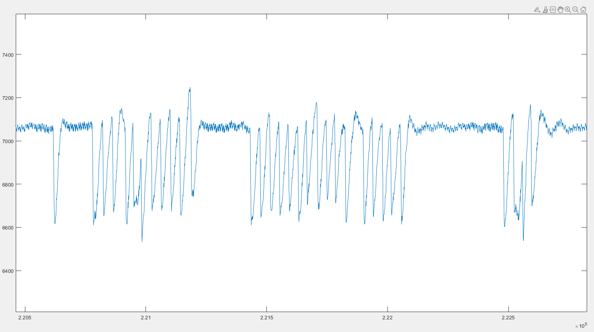

如果用比较判断算法，会发现有一些异常凸起无法判断。

但是所有变化都具有一个特征：斜率接近。于是可以针对其导数做处理，为了让噪声干扰变小，同时原有尖峰特征突出，采取移动窗口滤波，窗口值为5单位

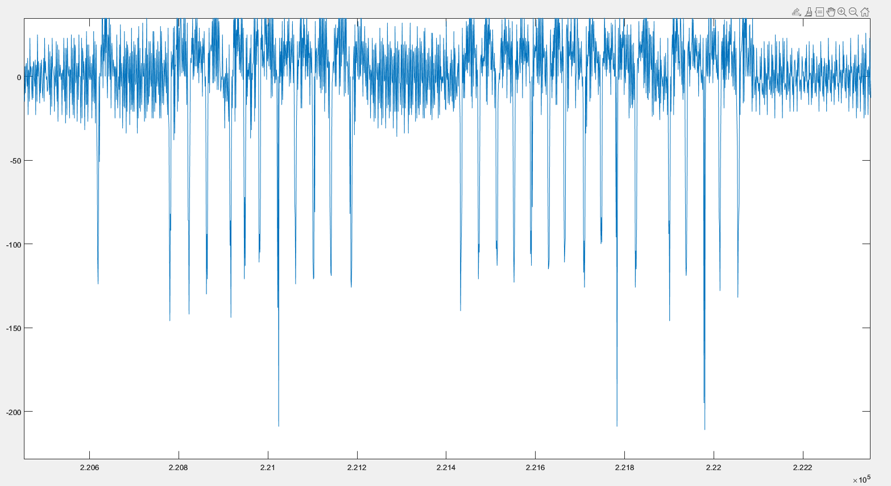

此时便可以通过比较器判断尖峰了。

### 数据处理：

  

### 效果：

###### 18m/s

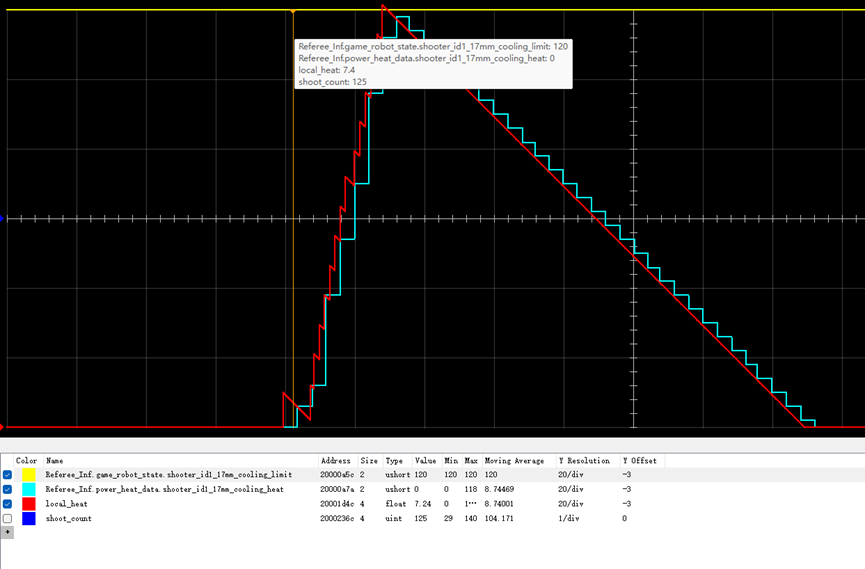

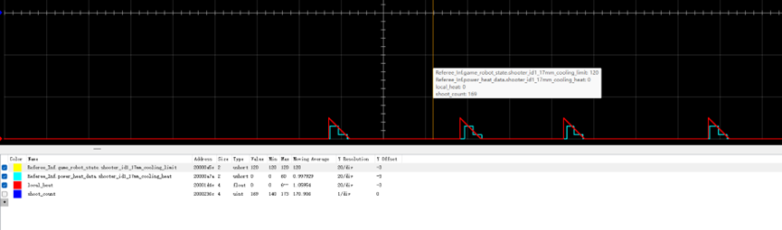

###### 30m/s

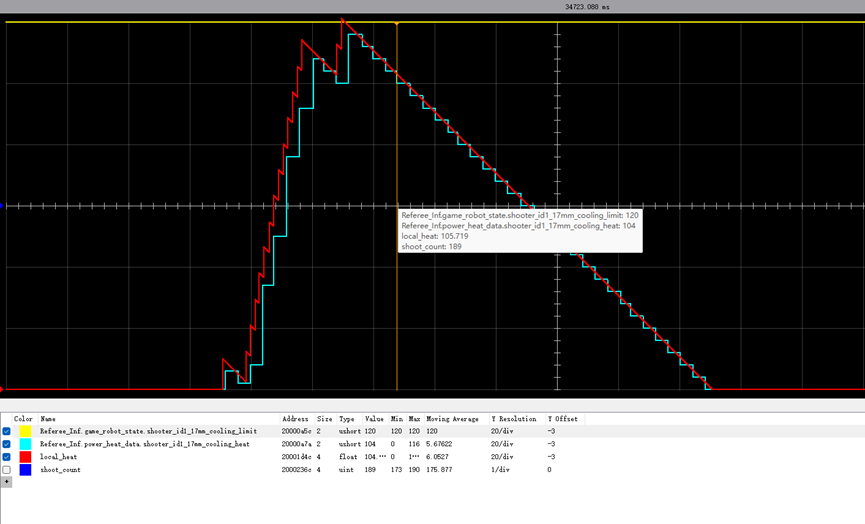

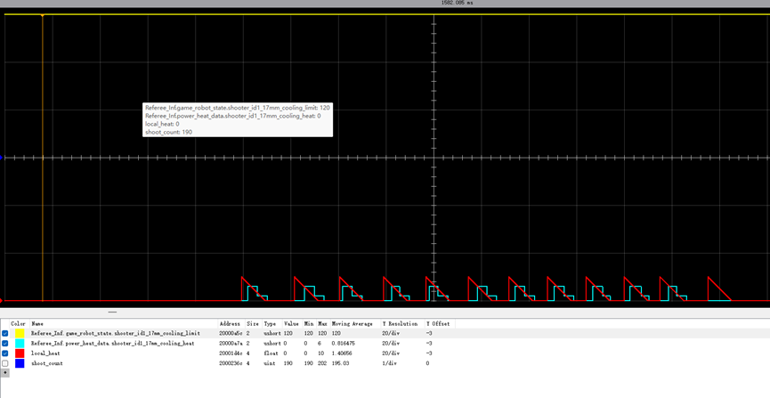

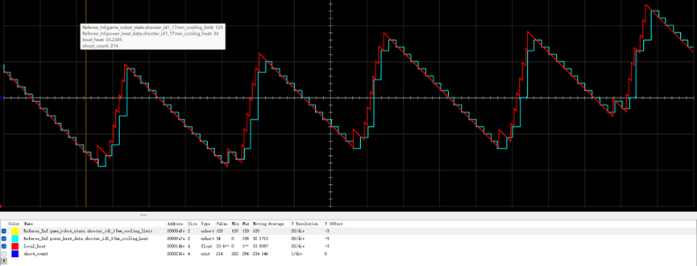

### 源码

#### 主要函数

```c
uint32_t shoot_count = 0;
void Shoot_Fric_data_process(void)
{
    /*----------------------------------变量常量------------------------------------------*/
    static bool bullet_waiting_confirm = false;										 // 等待比较器确认
    uint8_t shoot_speed = Referee_Inf.game_robot_state.shooter_id1_17mm_speed_limit; // 获取弹速
    int16_t data = CAN_Shoot[1].Current_Speed;										 // 获取摩擦轮转速
    static uint16_t data_histroy[MAX_HISTROY];										 // 做循环队列
    static uint8_t head = 0, rear = 0;												 // 队列下标
    float moving_average[2];														 // 移动平均滤波
    uint8_t data_num;																 // 循环队列元素个数
    float derivative;																 // 微分
    /*-----------------------------------逻辑控制-----------------------------------------*/
    data = abs(data);
    /*入队*/
    data_histroy[head] = data;
    head++;
    head %= MAX_HISTROY;
    /*判断队列数据量*/
    data_num = (head - rear + MAX_HISTROY) % MAX_HISTROY;
    if (data_num >= Fliter_windowSize + 1) // 队列数据量满足要求
    {
        moving_average[0] = 0;
        moving_average[1] = 0;
        /*同时计算两个滤波*/
        for (uint8_t i = rear, j = rear + 1, index = rear; index < rear + Fliter_windowSize; i++, j++, index++)
        {
            i %= MAX_HISTROY;
            j %= MAX_HISTROY;
            moving_average[0] += data_histroy[i];
            moving_average[1] += data_histroy[j];
        }
        moving_average[0] /= Fliter_windowSize;
        moving_average[1] /= Fliter_windowSize;
        /*滤波求导*/
        derivative = moving_average[1] - moving_average[0];
        /*导数比较*/
        if (derivative < -shoot_speed * 1.65)
        {
            bullet_waiting_confirm = true;
        }
        else if (derivative > -shoot_speed * 1.2)
        {
            if (bullet_waiting_confirm == true)
            {
                local_heat += One_bullet_heat; // 确认打出
                shoot_count++;
                bullet_waiting_confirm = false;
            }
        }
        rear++;
        rear %= MAX_HISTROY;
    }
}
```

**主函数执行需要放在1000Hz定时器中**

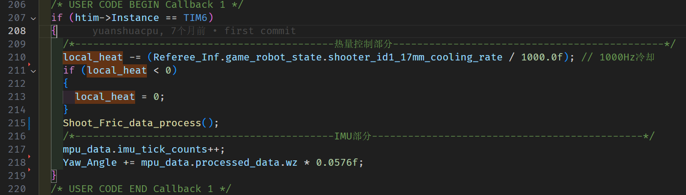

```c
/* USER CODE BEGIN Callback 1 */
if (htim->Instance == TIM6)
{
    /*-------------------------------------------热量控制部分---------------------------------------------*/
    local_heat -= (Referee_Inf.game_robot_state.shooter_id1_17mm_cooling_rate / 1000.0f); // 1000Hz冷却
    if (local_heat < 0)
    {
        local_heat = 0;
    }
    if (Referee_Inf.power_heat_data.shooter_id1_17mm_cooling_heat - Referee_Inf.game_robot_state.shooter_id1_17mm_cooling_limit >= 15) // 裁判系统判断已经超了热量
    {
        local_heat = Referee_Inf.power_heat_data.shooter_id1_17mm_cooling_heat;
    }
    Shoot_Fric_data_process();
    /*-------------------------------------------IMU部分---------------------------------------------*/
    mpu_data.imu_tick_counts++;
    Yaw_Angle += mpu_data.processed_data.wz * 0.0576f;
}
/* USER CODE END Callback 1 */
```

#### **热量控制部分**(应当在发射任务中)

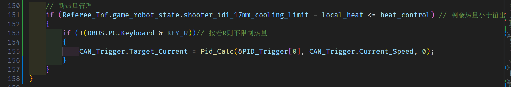

```c
// 新热量管理
if (Referee_Inf.game_robot_state.shooter_id1_17mm_cooling_limit - local_heat <= heat_control) // 剩余热量小于留出的热量
{
    if (!(DBUS.PC.Keyboard & KEY_R))// 按着R则不限制热量
    {
        CAN_Trigger.Target_Current = Pid_Calc(&PID_Trigger[0], CAN_Trigger.Current_Speed, 0);
    }
}
```

单发连发均限制热量，按住R键强制发射

#### 其他一些变量的初始化

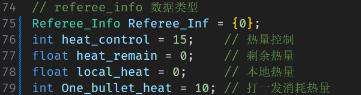

```c
// referee_info 数据类型
Referee_Info Referee_Inf = {0};
int heat_control = 12;    // 热量控制
float heat_remain = 0;    // 剩余热量
float local_heat = 0;     // 本地热量
int One_bullet_heat = 10; // 打一发消耗热量
```

**heat_control的值经过测试，12是个不错的选项**

**更激进可以改为10**

**更保守可以改为15或20**

#### .h文件中的宏定义

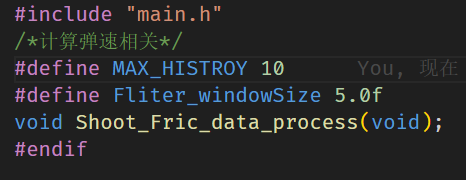

```c
#include "main.h"
/*计算弹速相关*/
#define MAX_HISTROY 10
#define Fliter_windowSize 5.0f
void Shoot_Fric_data_process(void);
#endif
```

**每个车摩擦轮体质不一样，如果有必要，需要采集摩擦轮转速进行分析**

